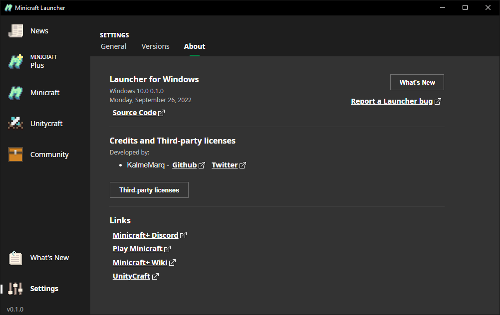

# Minicraft Launcher
The old ones are on [KalmeMarq/minicraft-launcher-tauri](https://github.com/KalmeMarq/minicraft-launcher-tauri) and [KalmeMarq/minicraft-launcher-electron](https://github.com/KalmeMarq/minicraft-launcher-electron) and this new version starts from 0.1.0 again and uses the same identifier, so uninstall the older one.

A launcher for all Minicraft versions and mods. Includes +190 version mods.

The UI is based on the Minecraft Launcher (it's pretty).

## About Minicraft
[Play Minicraft](https://playminicraft.com/)

"Minicraft was created by Markus "Notch" Persson, the creator of Minecraft, on December 19th, 2011. It was part of the 22nd Ludum Dare competition."

[Minicraft+ Discord](https://discord.gg/SMKCVuj)

[Minicraft+ Wiki](https://minicraft.fandom.com/wiki/Minicraft%2B)

## Translations

Translations are available in https://crowdin.com/project/minicraft-launcher. Feel free to contribute.